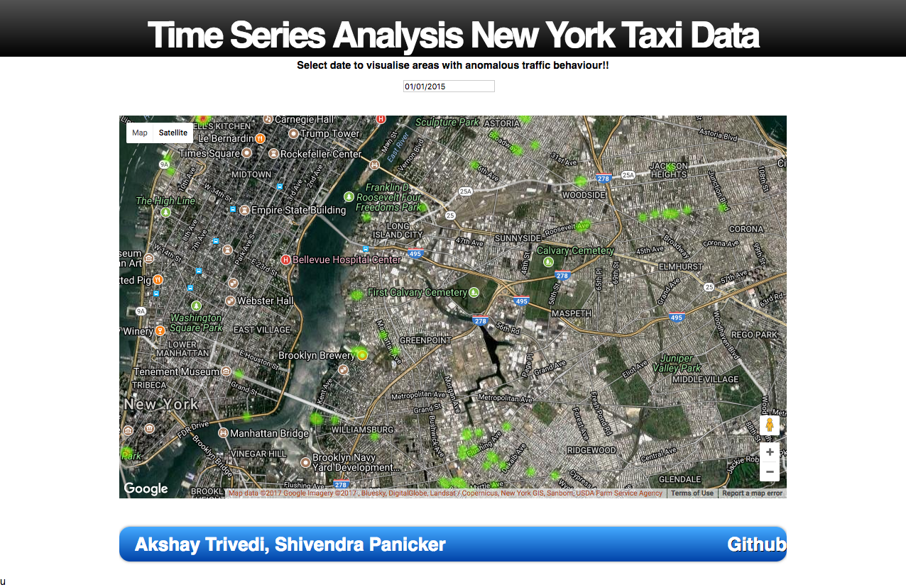

# Time series analysis of new york taxi data
## Utilizing taxi pickup and drop off data to find Interesting Spots!
1. Perform time series analysis of taxi data.
2. Divide complete new york state into 20x20 grids.
3. Generate time series annual, weekly and daily for each 20x20 grid point.
4. Decompose into seasonal, treand and residual. Utilize the residual part to get anomalous events.
5. Detect statistically most significant events using modified z-score as a metric.
6. Visualize all points on heat map over NYC google maps.
7. [View Demo](http://linserv1.cims.nyu.edu:45673)

